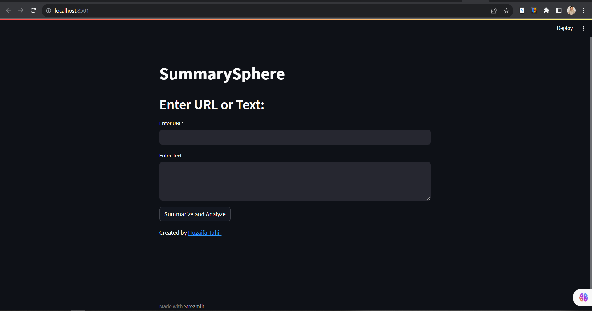

# distilbart-CNN-12-6 Summarization Model

> Summarize news articles with sentiment analysis using the distilbart-CNN-12-6 model and the Daily Mail and CNN datasets.

## Description

The distilbart-CNN-12-6 Summarization Model is a powerful tool for summarizing news articles while also performing sentiment analysis. It utilizes state-of-the-art NLP techniques to generate concise and informative summaries from extensive articles. This project is built on the Daily Mail and CNN datasets, making it a valuable resource for news analysis and content summarization.

---

## Features

- Summarize news articles using the distilbart-CNN-12-6 model.
- Perform sentiment analysis on the summarized content.
- Streamlit web app for easy interaction.
- Utilizes pre-trained language models for accuracy and efficiency.

---

